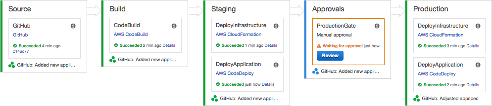
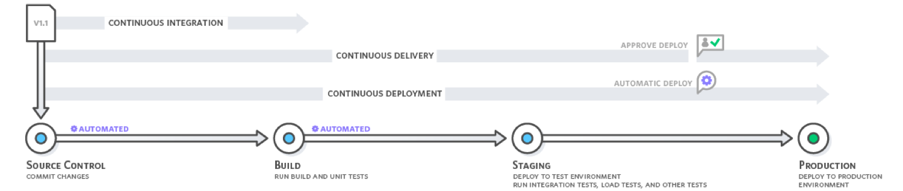
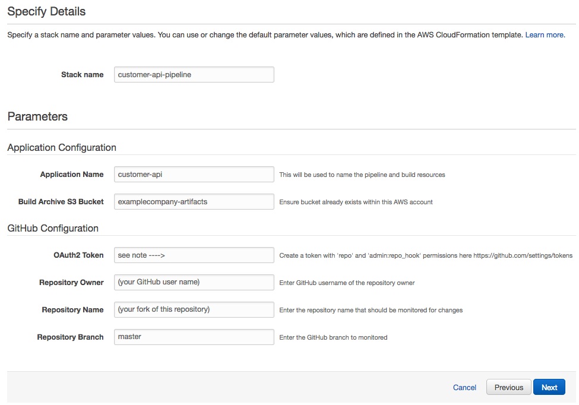
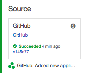
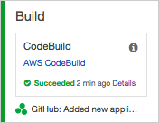
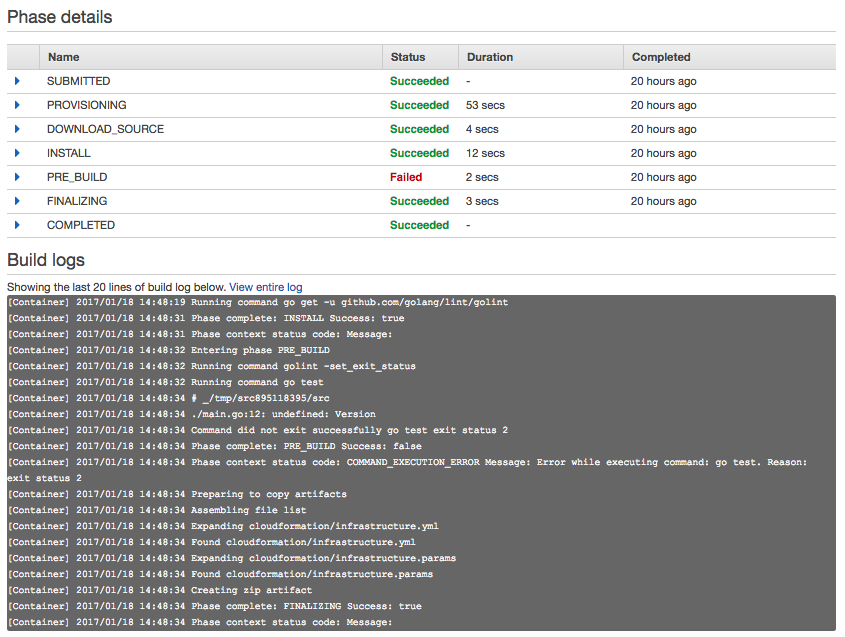
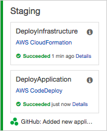
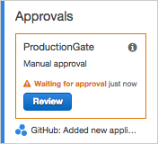

# Deployment Pipeline for Go Applications on AWS



This repository provides an easy-to-deploy pipeline for the development, testing, building and deployment of applications written in Go. Although this example is tailored to Go, it can be easily modified to deploy applications written in other languages too.

Services Used:
 
 * [AWS CodePipeline](https://aws.amazon.com/codepipeline/) for pipeline creation.
 * [AWS CodeBuild](https://aws.amazon.com/codebuild/) for testing and building your Go application(s).
 * [AWS CloudFormation](https://aws.amazon.com/cloudformation/) for deploying infrastructure (Infrastructure-as-Code).
 * [AWS CodeDeploy](https://aws.amazon.com/codedeploy/) for zero downtime deployments of your application(s). 

This pipeline allows you easily apply [continuous delivery](https://aws.amazon.com/devops/continuous-delivery/) or [continuous deployment](https://aws.amazon.com/devops/continuous-delivery/) principles to your development lifecycle. 



## Table of Contents

* [What's in the box?](#what's-in-the-box?)
 * [Source Control](#source-control)
 * [Build / Test](#build--test)
 * [Infrastructure-as-Code](#infrastructure-as-code)
 * [Zero Downtime Application Deployment](#zero--downtime-application-deployment-staging-production)
 * [Per Environment Configuration](#per-environment-configuration)
 * [Optional manual gate for Production](#optional-manual-gate-before-production)
* [How do I deploy this?](#how-do-i-deploy-this)
 * [Fork the repository](#1-fork-this-github-repository-to-your-github-account)
 * [Deploy the pipeline to your AWS account](#2-deploy-the-pipeline-to-your-aws-account)
 * [Develop, deploy, iterate!](#3-develop-deploy-iterate)
* [How does this work?](#how-does-this-work)
 * [Stage: Source](#stage-source)
 * [Stage: Test & Build](#stage-test--build) 
 * [Stage: Deploy to Staging](#stage-deploy-to-staging)
 * [Stage: Manual Approvals (optional)](#stage-manual-approvals)
 * [Stage: Deploy to Production](#stage-deploy-to-production)
* [Contributing](#contributing)
* [License](#license)

## What's in the box?
 
### Source control

A pipeline will be configured in [AWS CodePipeline](https://aws.amazon.com/codepipeline). It will automatically monitor a [GitHub](https://github.com) repository for modifications to  applications or infrastructure and push them through the delivery pipeline. 

### Build/test
 
[AWS CodeBuild](https://aws.amazon.com/codebuild) will be used to:

 - Run any tests included in the project (using `go test`).
 - Check for code lint errors (using `golint`).
 - Build your Go application.
 - Archive all build artifacts to S3.

To read or modify the [AWS CodeBuild](https://aws.amazon.com/codebuild) configuration, see [buildspec.yml](buildspec.yml).
 
### Infrastructure as code

[AWS CloudFormation](https://aws.amazon.com/cloudformation) will be used to deploy a staging and production environment suitable for hosting Go applications on AWS. This is incorporated into the same pipeline as the application development. Infrastructure for the staging and production environments will be automatically deployed as required.

By default, this will configure:

 - A [VPC](https://aws.amazon.com/vpc), with public and private subnets across multiple [Availability Zones (AZs)](http://docs.aws.amazon.com/AWSEC2/latest/UserGuide/using-regions-availability-zones.html).
 - An [Application load balancer](https://aws.amazon.com/elasticloadbalancing/applicationloadbalancer/) in the public subnets.
 - An [Auto Scaling group](https://aws.amazon.com/autoscaling/) of EC2 instances in private subnets.
 - [NAT gateways](http://docs.aws.amazon.com/AmazonVPC/latest/UserGuide/vpc-nat-gateway.html) to allow outbound internet access from the private subnets.

The following diagram shows an overview of the infrastructure deployed for each environment (staging and production):


You can read or modify the infrastructure deployed in [cloudformation/infrastructure.yml](cloudformation/infrastructure.yml).

### Zero-downtime application deployment (staging/production)

A sample Go application is included (see [main.go](main.go)) that acts as a simple webserver. 

When changes are made to the Go application, [AWS CodePipeline](https://aws.amazon.com/codepipeline) will automatically take the changes through the deployment pipeline.

[AWS CodeBuild](https://aws.amazon.com/codebuild) will run all tests, build the application, and then archive successful builds to [Amazon S3](https://aws.amazon.com/s3).

[AWS CodeDeploy](https://aws.amazon.com/codedeploy) will deploy the new application version to the [Auto Scaling group](https://aws.amazon.com/autoscaling) of [Amazon EC2](https://aws.amazon.com/ec2/) instances. By default, [AWS CodeDeploy](https://aws.amazon.com/codedeploy) will use the `CodeDeployDefault.OneAtATime` deployment strategy. However you can modify the [per-environment configuration](#per-environment-configuration) to use any of the strategies listed [here](http://docs.aws.amazon.com/codedeploy/latest/userguide/deployment-configurations.html).
 
### Per-environment configuration

In the [config/](config/) directory you will find a configuration file for each environment that you can use to override key settings, such as the [AWS CodeDeploy](https://aws.amazon.com/codedeploy) deployment strategy, instance types, and Auto Scaling group sizes.

Here is an example:

```json
{
    "Parameters": {
        "InstanceType": "t2.micro",
        "InstanceCount": "2",
        "DeploymentStrategy": "CodeDeployDefault.OneAtATime",
        "VpcCIDR": "10.193.0.0/16",
        "PublicSubnet1CIDR": "10.193.10.0/24",
        "PublicSubnet2CIDR": "10.193.11.0/24",
        "PrivateSubnet1CIDR": "10.193.20.0/24",
        "PrivateSubnet2CIDR": "10.193.21.0/24"
    }
}
```

See:

 * [config/staging.conf](config/staging.conf) 
 * [config/production.conf](config/production.conf)

Any changes made and committed back to your repository will be run through the pipeline and applied to your infrastructure/application automatically.

 
### Optional manual gate before production 

This pipeline includes an (optional) manual approval stage between the staging and production environments. This can be useful if you are not yet at the stage where you can move to fully automated continuous deployment.

 
## How do I deploy this?

#### 1. Fork this GitHub repository to your GitHub account

This new repository will be used for developing your application, infrastructure, and pipeline (through [AWS CloudFormation](https://aws.amazon.com/cloudformation)). Click the following button to initiate the fork: 

[](https://github.com/awslabs/golang-deployment-pipeline/fork)

#### 2. Deploy the pipeline to your AWS account

The pipeline is available as a [AWS CloudFormation](https://aws.amazon.com/cloudformation) template, and included in this repository ([see cloudformation/pipeline.yml](cloudformation/pipeline.yml)). Click the following button to deploy it to your AWS account in the `us-east-1` region:
 
[](https://console.aws.amazon.com/cloudformation/home?region=us-east-1#/stacks/new?stackName=\<myapp>-pipeline&templateURL=https://s3.amazonaws.com/golang-deployment-pipeline/cloudformation/pipeline.yml)  

You will need to provide some parameters to point [AWS CodePipeline](https://aws.amazon.com/codepipeline) to the repository you forked in your account. For example:



After the [AWS CloudFormation](https://aws.amazon.com/cloudformation) stack has been created, you will find your new pipeline in the [AWS CodePipeline](https://aws.amazon.com/codepipeline) console.

#### 3. Develop, deploy, iterate!

Now that your pipeline is setup, you can start the fun part:  developing your application! Make some changes to the example Go application in [main.go](main.go), and then commit the changes to your [GitHub](https://github.com) repository.

In the [AWS CodePipeline](https://aws.amazon.com/codepipeline) console, you should see the changes you've made flow through the pipeline.

To find the URL of your staging and production environments, go to [AWS CloudFormation](https://aws.amazon.com/cloudformation) console, find the staging or production stack and look at the stack output. You will see a link to your load-balanced URL. For convenience, you will probably want to create a more convenient CNAME in your DNS to point to this URL. (Or just bookmark it!) It will remain constant across application deployments.

## How does this work?

### Stage: Source



A hook is used to notify [AWS CodePipeline](https://aws.amazon.com/codepipeline) of any updates to your GitHub repository. This will trigger the `Source` stage of your pipeline automatically.

### Stage: Test and Build



[AWS CodeBuild](https://aws.amazon.com/codebuild) will then run your application tests, check code linting and build your application. After a successful build, it will archive the build artifact(s) to the [Amazon S3](https://aws.amazon.com/s3) bucket provided when you deployed your pipeline.

If there are any failures in your test or build process, they will be displayed in the [AWS CodePipeline](https://aws.amazon.com/codepipeline) console. Click on the **Detail** link in the pipeline stage to see the full build log. This will help you identify the reason for the failure.

 

### Stage: Deploy to staging 



This stage uses [AWS CodePipeline's ability to deploy with AWS CloudFormation](https://aws.amazon.com/blogs/aws/codepipeline-update-build-continuous-delivery-workflows-for-cloudformation-stacks/).

It will deploy the infrastructure for the staging environment (as defined in [cloudformation/infrastructure.yml](cloudformation/infrastructure.yml)). 

The first time the pipeline stage runs, it will create the environment from scratch. On future runs, it will apply any updates through a [CloudFormation stack update](http://docs.aws.amazon.com/AWSCloudFormation/latest/UserGuide/using-cfn-updating-stacks.html). 

It will also use [AWS CodeDeploy](https://aws.amazon.com/codedeploy) to deploy and validate the application. You can see the [AWS CodeDeploy](https://aws.amazon.com/codedeploy) configuration in [appspec.yml](appspec.yml)

### Stage: Manual Approvals 



This pipeline includes an (optional) manual approval stage between the staging and production environments. This can be useful if you are not yet at the stage where you can move to fully automated continuous deployment.

If you want to remove this from your pipeline, just edit the pipeline definition in [cloudformation/pipeline.yml](cloudformation/pipeline.yml) and update your pipeline [AWS CloudFormation](https://aws.amazon.com/cloudformation) stack with the new template.

The approval can be configured to trigger an [Amazon Simple Notification Service (SNS)](https://aws.amazon.com/sns) notification. This allows you to notify approvers of pending actions through Email, SMS or a custom [AWS Lambda](https://aws.amazon.com/lambda) function.

### Stage: Deploy to production 


This stage deploys a whole new environment (everything in the architecture diagram) for your production environment. This ensures an identical configuration between environments, reducing false positives in your testing. 

The first time the pipeline stage runs, it will create the environment from scratch. On future runs of the pipeline, it will apply any updates via a [CloudFormation stack update](http://docs.aws.amazon.com/AWSCloudFormation/latest/UserGuide/using-cfn-updating-stacks.html).

## Want to contribute?

You can [create a GitHub issue](https://github.com/awslabs/golang-deployment-pipeline/issues/new) for any feature requests, bugs, or documentation improvements. 

Where possible, please [submit a pull request](https://help.github.com/articles/creating-a-pull-request-from-a-fork/) for the change. 
